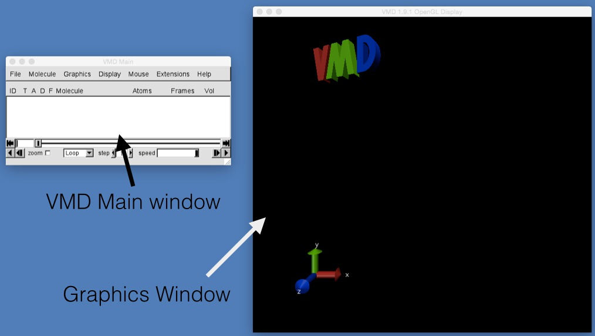
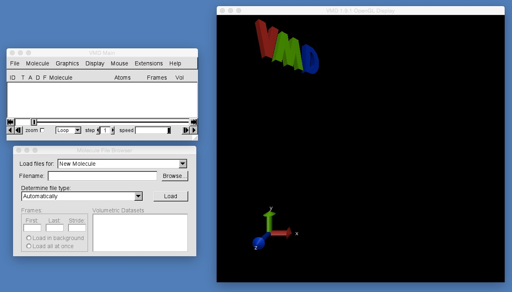
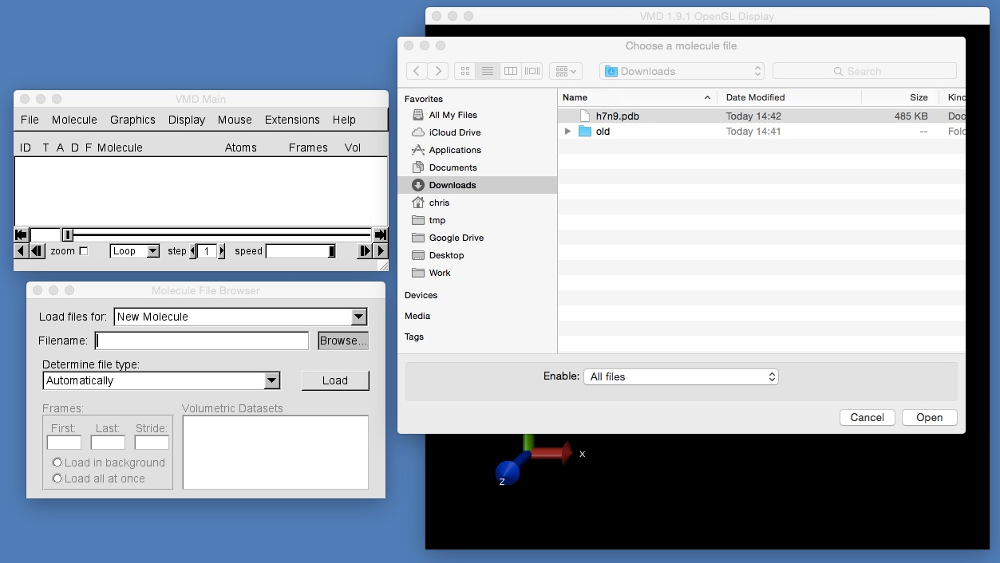
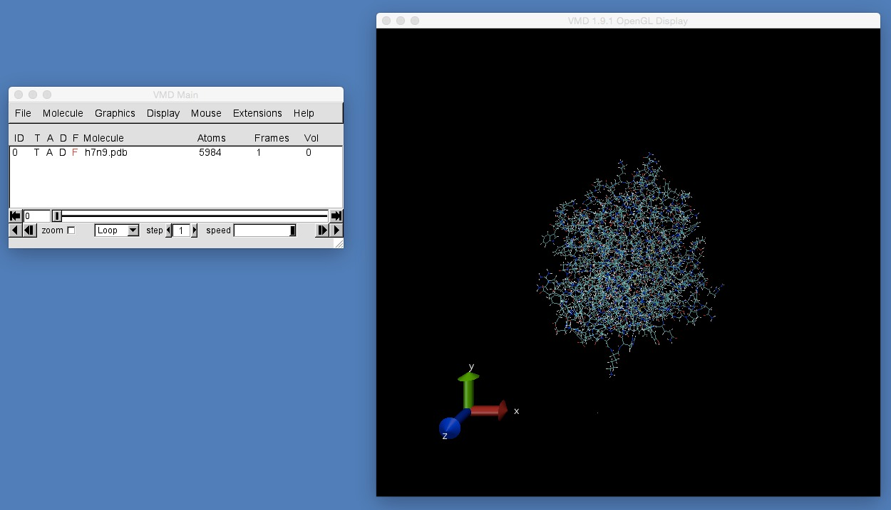

# Part 1: Molecular Visualisation
## Opening files

To start, open a terminal window (e.g. gnome-terminal, terminal or a bash shell). To start VMD, in this terminal type;

```
vmd
```

This should bring up a VMD graphical view together with a "VMD main" window, as seen below.



Next, you need to download [this file, h7n9.pdb](https://raw.githubusercontent.com/chryswoods/python_for_bio/master/dynamics/visualisation/h7n9.pdb). Depending on your browser, you may need to right click on this link and click "Save As..." or "Download As...".

Once you have downloaded h7n9.pdb, load it into VMD by clicking "File | New Molecule..." in the "VMD main" window. This will open up the "Molecule File Browser" as you can see below.



In the "Molecule File Browser" click "Browse". This will open a file dialog that allow you to navigate your file system. Find the directory into which you downloaded h7n9.pdb. Select this file, and then click "Open".



VMD should be clever enough to work out that h7n9.pdb is a PDB file (PDB stands for "Protein Data Bank" and is the (old) standard file format used to store protein X-ray crystal structures in the [PDB](http://pdb.org/pdb/home/home.do)). Assuming that the file type under "Determine file type:" is "PDB" (as below) click "Load".


VMD will now load the molecules contained in h7n9.pdb and will display them in the VMD graphical view window (as below).



# [Previous](README.md) [Up](README.md) [Next](mouse.md)
