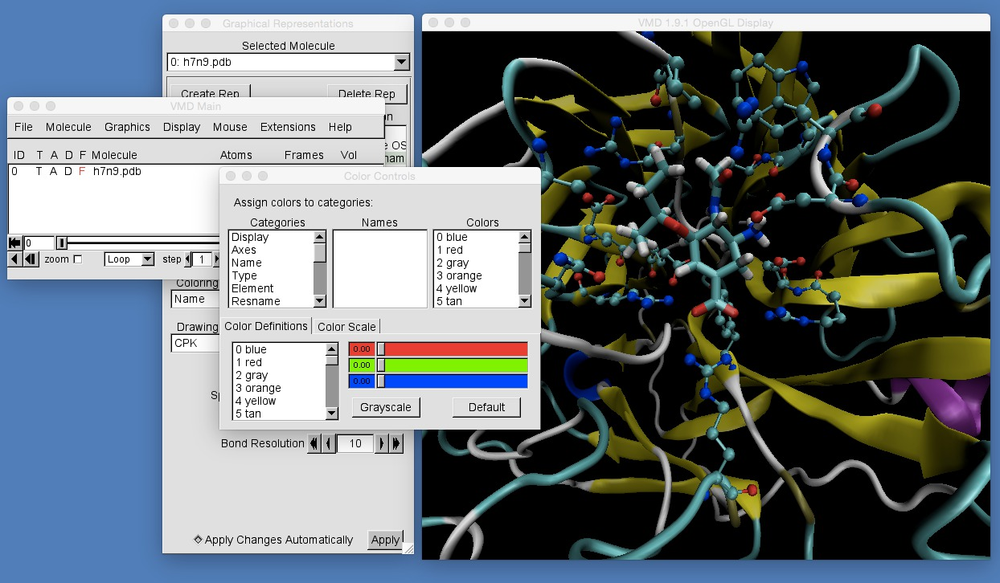
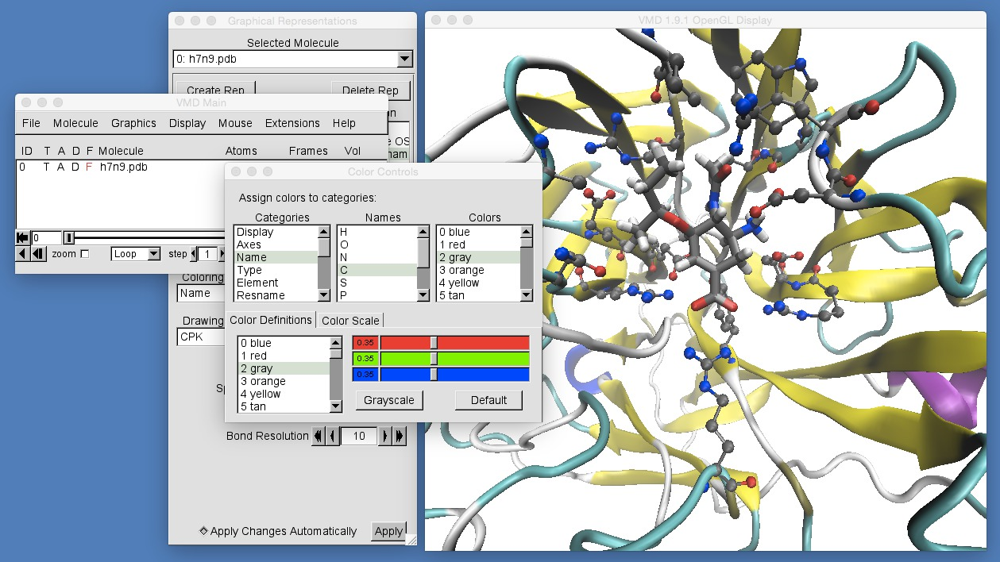
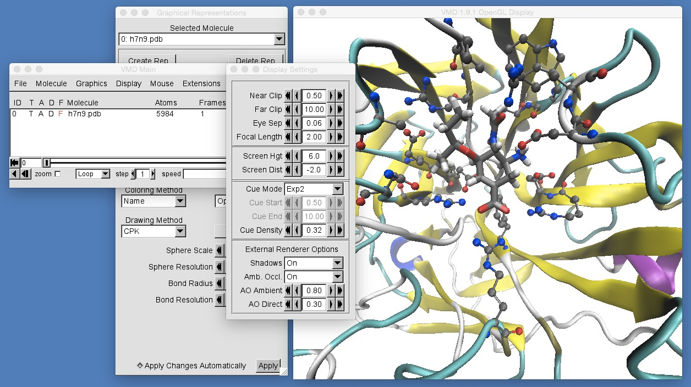
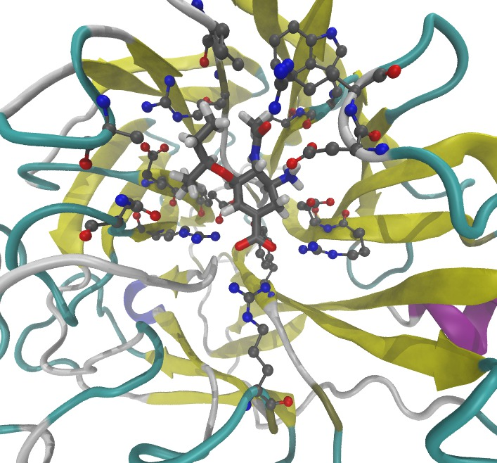

# Part 1: Molecular Visualisation
## Rendering

VMD can be used to render high quality pictures for publications. To do this, there are a series of settings that should be changed.

First, you will want to remove the axes that are displayed in the bottom left of the VMD graphical display window. You do this by clicking "Display | Axes | Off" in the VMD main window.

Next, you may want to change the background color from black to white. You can do this by opening the "Color Controls" window by clicking "Graphics | Colors..." in the VMD main window. This will open up a dialog box that looks like this;

Here you can choose the colors that VMD uses to draw everything. To change the background, click "Display", then "Background" then scroll up the "Colors" list to find "white" (number 8).

You can also change the color of the atoms. Personally, I don't like the carbon atoms being cyan. I prefer to use dark colors, e.g. gray. To change the color of the carbon atoms to gray, choose "Name", then "C", then "gray" (number 2).

To render the picture, we need to tell VMD that we want a high quality render. To do this, we want to turn on "Ambient Occlusion", which is a nice way of handling light in a 3D render. To turn this on, click "Display | Display Settings..." in the VMD main window. This will open up the "Display Settings" window. In this, turn "Amb. Occl." on, and also turn "Shadows" on.

Now (finally) to render the picture;

* Click "File | Render..." in the VMD main window. This will open up the "File Render Controls" window. 
* VMD supports rendering using many different rendering packages. VMD also comes with an in-built version of the "Tachyon" renderer. This is the best to use, so select "Tachyon (internal, in-memory rendering)" as the render method (next to "Render the current scene using"),
* Set the "Filename" to whatever name you want to use for the output (normally defaults to "vmdscene.tga"). 
* Then click "Start Rendering". 

Rendering will take a while (about 1-2 minutes), and the result should be something that looks like this;

While our effort isn't that spectacular, VMD has been used to create some pretty stunning images. Some of these can be [seen here](http://www.ks.uiuc.edu/Gallery/Science/). Have a play now and see what you can come up with.

# [Previous](complex_selection.md) [Up](README.md) [Next](movies.md)
