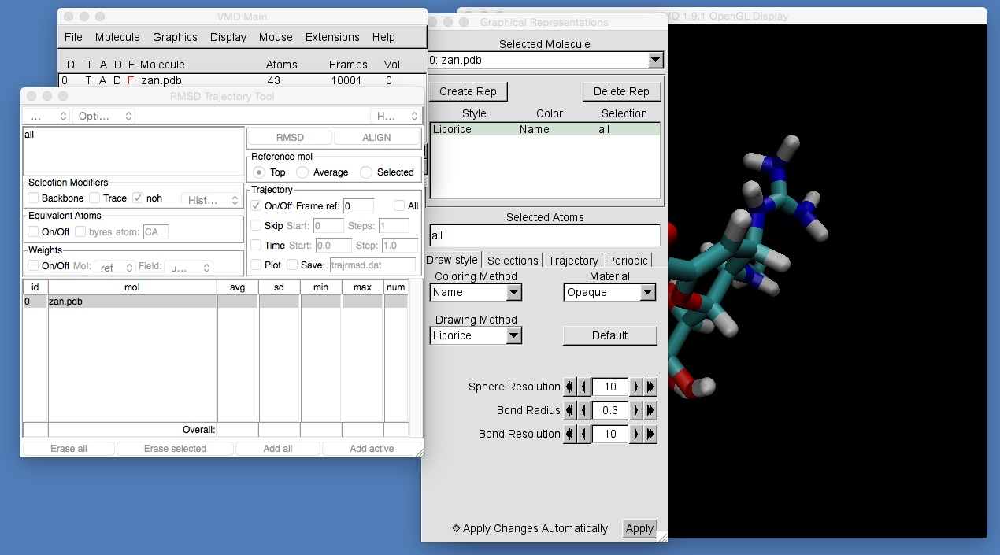

# Part 2: Molecular Dynamics
## Getting Started

First, download [this file, 'dynamics.tgz'](https://drive.google.com/uc?export=download&id=0B_KkGMZ8ACfaRnRwTUN5MUhSTTQ). This contains all of the input files that are needed for this part of the workshop. Once you have downloaded the file, in your terminal use 'cd' to change to the directory in which you have downloaded dynamics.tgz. For example, if you downloaded 'dynamics.tgz' to your $HOME/Downloads directory type

```
cd $HOME/Downloads
```

Once you have changed into this directory, unpack dynamics.tgz by typing;

```
tar -zxvf dynamics.tgz
```

This will unpack all of the files contained in dynamics.tgz into a new directory called dynamics. Change into this directory by typing;

```
cd dynamics
```

Now take a look in this directory by using "ls" to list files in the directory.

```
ls
```

You should see the following two directories in this directory.

```
:-> ls
complex  gasphase
```

The directory 'complex' contains the input files for later. The directory 'gasphase' contains the input files that we will be using now. Change into this 'gasphase' directory by typing;

```
cd gasphase
```

Take a look in this directory by using "ls".

```
:-> ls
mdconfig   zan.pdb    zan.prmtop zan.rst
```

As you can see, there are four files. These files can be used to run a molecular dynamics simulation of a single molecule of zanamivir in the gas phase. Zanamivir is another influenza drug (also called Relenza) that targets neuraminidase. To run the molecular dynamics simulation type;

```
$NAMD/namd2 +ppn 4 mdconfig
```

This will run the molecular dynamics simulation using the program 'namd2'. The option '+ppn 4' tells the program to run using 4 processors. If you have more than 4 processors available on your computer, you can increase this number to equal the number of processors. The file 'mdconfig' is a configuration file that is used to control the dynamics simulation.

The simulation runs 50000 steps of dynamics and should take about 1-2 minutes to complete. Once it has finished, you should see something like;

```
The last velocity output (seq=50000) takes 0.003 seconds, 2431.430 MB of memory in use
WRITING EXTENDED SYSTEM TO OUTPUT FILE AT STEP 50000
WRITING COORDINATES TO OUTPUT FILE AT STEP 50000
CLOSING COORDINATE DCD FILE
WRITING VELOCITIES TO OUTPUT FILE AT STEP 50000
The last velocity output (seq=-2) takes 0.004 seconds, 2431.430 MB of memory in use
====================================================

WallClock: 38.105480  CPUTime: 38.105480  Memory: 2431.429688 MB
Program finished.
```

It will have also produced a set of output files. You can see these by using "ls", e.g.

```
:-> ls
mdconfig            output.dcd          output.restart.vel  output.vel          zan.pdb             zan.rst
output.coor         output.restart.coor output.restart.xsc  output.xsc          zan.prmtop
```

You can visualise the dynamics trajectory using VMD. You can do this by typing;

```
vmd zan.pdb output.dcd
```

This will automatically open 'zan.pdb' and will load the 'output.dcd' molecular dynamics trajectory into this structure. 

Use the movie controls to play the trajectory. You should see zanamivir wriggling and jiggling around on the screen. To make it easier to view the molecule, you should change the graphical representation for zanamivir to "licorice" and should use the RMSD Trajectory Tool to align the molecule. Do this by opening up the tool and setting the selection string for alignment to "all" (see below).



Once you have aligned zanamivir, you should see that the molecule stays in the centre of the screen as the atoms jiggle around.

# [Previous](README.md) [Up](README.md) [Next](theory.md)
