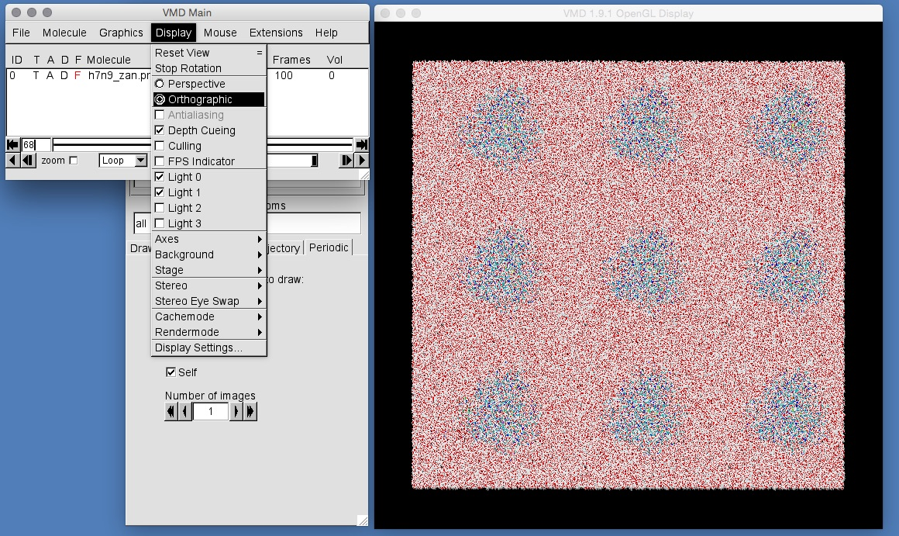

# Part 2: Molecular Dynamics
## Under Pressure

In the last section you learned how to use periodic boundary conditions to simulate your biomolecular system in an infinite number of images of a periodic box of water. While great, the use of periodic boundary conditions on their own has one drawback - the volume of each periodic box is a constant. This means that the pressure of the system is undefined. This can be important depending on the type of ensemble that we wish to sample during our molecular dynamics simulation.

There are three main ensembles that are important for biomolecular simulations;

* NVE or microcanonical ensemble : The number of atoms, volume of the box and the total energy of the molecules is kept constant
* NVT or canonical ensemble : The number of atoms, volume of the box and the temperature of the simulation is kept constant
* NPT or isothermal-isobaric ensemble : The number of atoms, and the pressure and temperature of the simulation is kept constant

The closest ensemble to 'reality' is NPT, where the simulation runs at constant temperature and pressure. In a simulation we have a choice of which ensemble to use. If we want to control temperature, then we have to use a thermostat. This is specified and controlled in 'mdconfig' in the lines that read;

```
# Options used to set the temperature of the simulation
# to 300 K
temperature 300
langevin on
langevinDamping 5
langevinTemp 300
```

There are many different thermostat algorithms available. The best thermostat to use in namd is the "Langevin" thermostat. This randomly adjusts the velocity of all of the atoms to achieve the specified temperature (in this case, 300 kelvin). 

If we want to control the pressure, we need to use a barostat. Again, there are many different barostat algorithms available, with the choice of barostat normally coupled with the choice of thermostat. The best barostat to use for biomolecular simulations is namd is the "Langevin" barostat. This randomly changes the volume of the periodic box, and can be switched on by adding the following lines to 'mdconfig'

```
# Options used to set the pressure of the simulation
langevinPiston on
langevinPistonTarget 1.01325
langevinPistonPeriod 100
langevinPistonDecay 50
langevinPistonTemp 300
useFlexibleCell yes
useConstantArea no
langevinHydrogen off
useGroupPressure yes
xstFreq 1000
```

The important lines are "langevinPiston" which turns on or off the use of a Langevin barostat, and "langevinPistonTarget" which specifies the desired pressure (in atmospheres). The option "langevinPistonTemp" sets the 'temperature' of the random noise used by the algorithm, and should be set to the same temperature as the simulation. Another important option is "xstFreq", which specifies the frequency of writing out a restart file that contains the dimensions of the periodic box. If you are interested in the meaning of the other options, please [take a look here](http://www.ks.uiuc.edu/Training/Tutorials/namd/namd-tutorial-unix-html/node9.html).

Use a text editor (e.g. nano) to add a Langevin barostat to 'mdconfig'. Once you have made the changes, re-run the dynamics simulation by typing;

```
$NAMD/namd2 ++ppn 4 mdconfig
```

Once the simulation has finished, visualise the trajectory in VMD by typing

```
vmd h7n9_zan.prmtop output.dcd
```

and then turn on one layer of periodic images. Make sure that you can still see the water molecules and then play the movie. Can you see the box changing shape? You may find it easier to view by changing the display from "perspective" view to "orthographic" view. Do this by selecting "Display | Orthographic" in the VMD main window. This will turn off the perspective distortion that VMD uses to render things closer to the screen bigger, and things further from the screen smaller. With orthographic view, everything is drawn at the same size regardless of how far it is from the screen.



# [Previous](protein.md) [Up](README.md) [Next](simulation.md)
