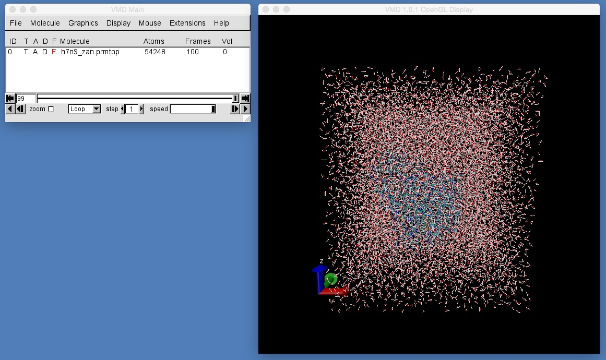
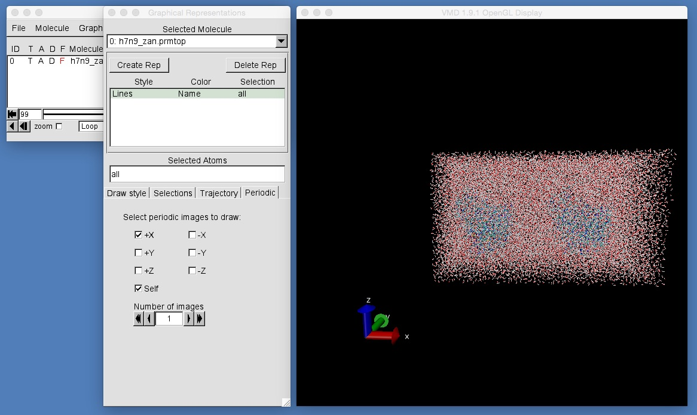
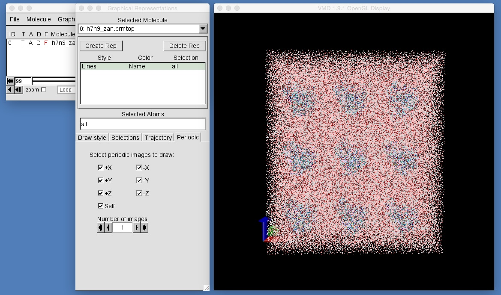

# Part 2: Molecular Dynamics
## Periodic Boundary Conditions

In the last section you saw how SHAKE can be used to constrain the lengths of bonds involving hydrogen. This allows the molecular dynamics timestep to be roughly doubled from what it would be if these bonds were being sampled (and so, in the case of gas phase zanamivir, the timestep could be increase from 2-3 femtoseconds to 4-5 femtoseconds).

In this section we are going to look at how to simulate molecules in the solvent phase. The files for this section are in the directory 'complex'. Change into this directory by typing

```
cd ../complex
```

This directory contains the following files;

```
:-> ls
h7n9_zan.prmtop h7n9_zan.rst    mdconfig
```

These are the input files to run a molecular dynamics simulation of zanamivir bound to H7N9 neuraminidase in a box of water. Run the simulation by typing;

```
$NAMD/namd2 ++ppn4 mdconfig
```

The simulation runs 1000 steps of molecular dynamics with a timestep of 2 femtoseconds and should take about 1-2 minutes to complete. Once the simulation has finished, visualise the output by typing

```
vmd h7n9_zan.prmtop output.dcd
```

You should see something like this;



What you can see is zanamivir bound to neuraminidase, and all solvated in a box of water. If you rotate the view you will see that the protein is almost poking out from one side of the box, with some of its atoms appearing to be outside the box. This is not a cause for concern, but is instead an artefact of what is called "periodic boundary conditions". This box of water is actually what is known as a periodic box. This box is actually infinitely mirrored and reflected along the X, Y and Z dimensions, such that atoms on one face of the box are wrapped and placed next to the atoms on the opposite face. VMD provides tool that can help us visualise this infinite reflection of periodic boxes. Open the graphics representation window and select the "Periodic" tab (the right-most tab along the line of "Draw Style", "Selections", "Trajectory" and "Periodic"). The controls in this tab allow us to view the periodic images of the box in the X, Y and Z dimensions. Currently only the "central" box is visible. If you click on the "+X" box then VMD will draw the periodic image which is along the positive X axis. 



As you can see, you will now have two copies of the periodic box of water containing neuraminidase and zanamivir. One is the "central" box, while the other is the reflection along the positive X axis (see the axes in the bottom left of the VMD graphics window). If you click on the other boxes ("-X", "+Y", "-Y", "+Z" and "-Z") you will draw all of the periodic images along each axis, and will now have 27 copies of the box of water, with 27 proteins and 27 molecules of zanamivir.



Currently, only the first layer of periodic images are being drawn by VMD. You can draw the second layer by increasing "Number of images" from 1 to 2. This will now draw two layers of periodic images, and so you will see 625 copies of the water box, protein and zanamivir. You can keep increasing the number of layers, although you will eventually reach a point when VMD will struggle to display all of the periodic images, and when VMD will eventually crash.

While VMD is limited in the number of periodic images that are shown, namd was able to simulate the protein with an infinite number of periodic images. This use of periodic boundary conditions means that there are no hard boundaries between the water and gas phase in the simulation. In effect, we are simulating an infinite number of identical copies of the protein, where each copy can see and interact with each other copy. The changes to the 'mdconfig' file that were needed to achieve this are shown below;

```
# Turn on the use of the Particle Mesh Ewald algorithm that is used
# to model long-range electrostatic interactions. This requires an associated
# PMEGridSpacing option that should have the value 1.0 for biological systems
PME on
PMEGridSpacing 1.0

# Set the basis vectors of the periodic box. These numbers 
# come from the last three numbers in the h7n9_zan.rst file above,
# and give the size of the X, Y and Z dimensions of the periodic box
cellBasisVector1   74.8526538  0  0
cellBasisVector2   0  84.9647470  0
cellBasisVector3   0  0  85.7668218
```

The first set of options turns on the use of the [particle mesh Ewald algorithm (PME)](http://en.wikipedia.org/wiki/Ewald_summation). This is the clever algorithm that allows each periodic image to interact electrostatically with the infinite number of other periodic images. All simulations that use periodic boundary conditions should turn on PME. The PMEGridSpacing option relates to the density of mesh points used in the algorithm, and should be similar to the atomic density of the system. For solvated biomolecular systems, a value of 1.0 is nearly always appropriate.

The second set of options tell namd to use periodic boundaries, and are used to supply the basis vectors for the periodic box. Periodic boundary conditions can use any space-filling shape, although orthorhombic (cubic) boxes are the most common. These are simple boxes with an X, Y and Z vector that correspond to the lengths of the box along the X, Y and Z axes. In this case, the periodic box has dimensions 74.85 x 84.96 x 85.77 angstroms^3. These values must equal the size of the box as it is contained in the restart file, h7n9_zan.rst, and are part of the last six numbers in this file.

```
  -0.3212700   0.3287044  -0.0981419  -0.5703607  -0.2795512  -0.0473179
  -0.1386293   0.0120056   0.0946456   0.1048827  -0.1653300  -0.3143062
  -0.4345136   0.2292429   0.7672179   0.1752952  -0.1510855   0.1187321
  -0.0049175   0.6369751  -0.2629314   0.7521200   0.1580263   0.9569773
  74.8526538  84.9647470  85.7668218  90.0000000  90.0000000  90.0000000
```

(the last three numbers are the angles between the three basis vectors. Values of 90 degrees imply that the box is cubic)

While it is important that water is simulated, it can get in the way when trying to look at the simulation in VMD. Use what you learned in the first part of this workshop to create representations of the protein and of zanamivir (resname ZAN). Once you have created these representations, play the movie of the trajectory and see what you can see. Can you see the multiple copies of the protein and zanamivir?

# [Previous](shake.md) [Up](README.md) [Next](.md)
