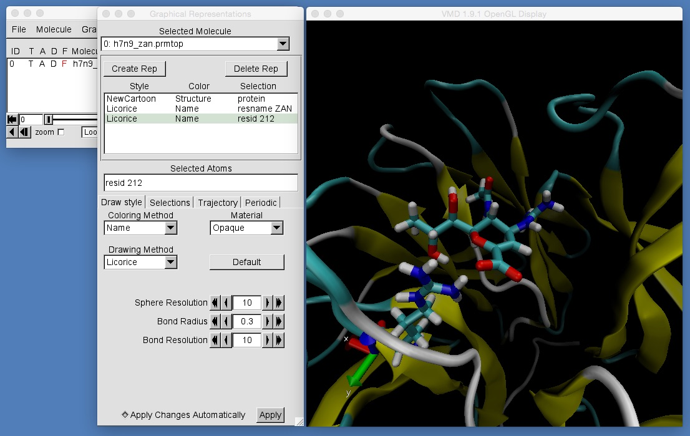

# Part 3: Mutating Proteins and MD Setup
## Comparing Trajectories

In this part of the workshop you have set up and are running a long molecular dynamics simulation of zanamivir binding to mutant H7N9-R292K neuraminidase. At the end of the  [last part](../dynamics/simulation.md) you ran a long molecular dynamics simulation of zanamivir binding to wild type H7N9 neuraminidase. In this last section of the workshop you will look at the two trajectories from these simulations and will use VMD to compare them to see whether or not the R292K mutation affects binding.

First, we will look at the wild type simulation. Change into the directory containing the output from your wild type simulation (or, if you don't have this output, you can download 
[example output here](https://drive.google.com/uc?export=download&id=0B_KkGMZ8ACfaZDVUZ3A4MEFSN00)). Once you have changed into the directory, type;

```
vmd h7n9_zan.prmtop output.dcd
```

Create graphical representations that highlight neuraminidase, zanamivir and arginine 292 (resid 212), e.g.



Next, we will look at your mutant H7N9-R292K simulation. 

(or, if you don't have this output, your can download [example output here](https://drive.google.com/uc?export=download&id=0B_KkGMZ8ACfaUXk0TlRJYVUxVWM)). Once you have changed into this directory, type;

```
vmd h7n9_r292k_zan.prmtop production.dcd
```


# [Previous](simulation.md) [Up](README.md) [Next](whatnext.md)
