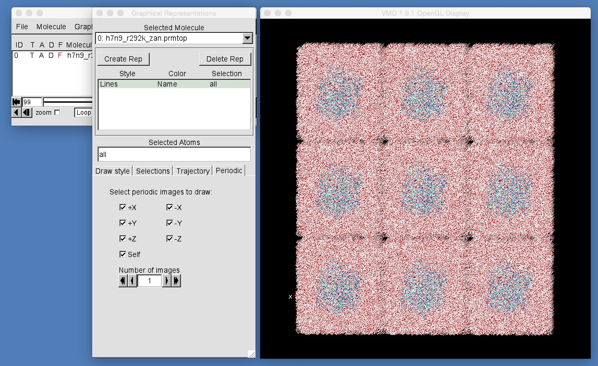

# Part 3: Mutating Proteins and MD Setup
## Equilibrating the System

Now that you have heated the system, the next step is equilibration. You need to perform a small amount of canonical (NVT) dynamics to allow the water molecules that were added by tleap to properly position themselves around the protein and water. This is because tleap is very conservative when it adds water molecules, and will add them with a bit of a gap between each water and the protein and drug. This initial NVT equilibration allows the water molecules to move to fill in these gaps, thereby ensuring that we don't get vacuum bubbles appearing near the protein when we start applying pressure and switch to NPT.

The NVT canonical equilibration is configured using the namd configuration file "equilconfig". This is very similar to the NVT dynamics configuration file that you used in the [last part of the workshop](../dynamics/protein.md).

Run the simulation using the command;

```
$NAMD/namd2 ++ppn 4 equilconfig
```

This will run only 2500 steps (5 picoseconds) of equilibration. As before, we are using only a small number of steps so that you can run the simulation within the time available for this workshop. Ideally you would equilibrate for at least 50,000 steps (100 picoseconds).

Once the simulation has finished, you will have new files that are all called "equilibrated.something", e.g. equilibrated.dcd will contain the trajectory file for the equilibration simulation. You can view this in VMD by typing;

```
vmd h7n9_r292k_zan.prmtop equilibrated.dcd
```

Use the "Periodic" tab in the "Graphical Representation" window to view the first shell of periodic images. Play the movie. You should see that the water molecules spread out to fill in the gaps between periodic images (you may see this more easily by switching to "orthographic"). 



Ideally, you would run equilibration until the gaps had been filled completely. However, because we have limited time, we will accept what we have produced so far and will move on...

The NVT equilibration you have just performed has allowed the water molecules to move to properly solvate the protein and to fill in any spaces, but this has come at the cost of lowering the density of the water. To allow the water to achieve its correct density, we now have to run some equilibration where we allow the box size to change and apply a constant pressure (NPT or isothermal-isobaric conditions). This NPT equilibration is controlled using the namd configuration file "equilconfig2", and can be run by typing;

```
$NAMD/namd2 equilconfig2
```

This will perform 2500 steps (5 picoseconds) of NPT equilibration. Again, for a real simulation, if you had more time, you would ideally you should run significantly more NPT equilibration, e.g. 1-5 nanoseconds (so 500,000 to 2,500,000 steps!). However, as time is limited, we will stick with just the 2500 steps.

Once the simulation has finished you should find more output files, now called "equilibrated2.something", e.g. equilibrated2.dcd. You can view the NPT equilibration trajectory by typing;

```
vmd h7n9_r292k_zan.prmtop equilibrated2.dcd
```

Again, use the "Periodic" tab to view the first shell of periodic images, and play the movie. Look for the boxes shrinking, and also whether or not you can see any gaps between the boxes or any vacuum bubbles. 


In this case, you can still see a bit of a gap and a bubble at the corner of the boxes, and, in an ideal world, would run this equilibration for a little longer. However, as we don't have enough time, we will continue onto the next stage...

# [Previous](heating.md) [Up](README.md) [Next](simulation.md)
