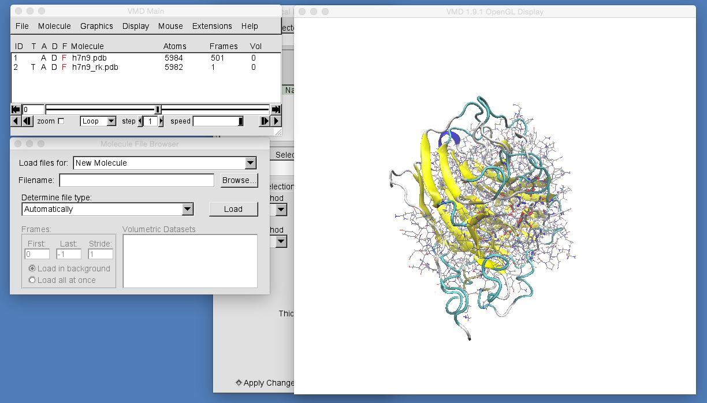
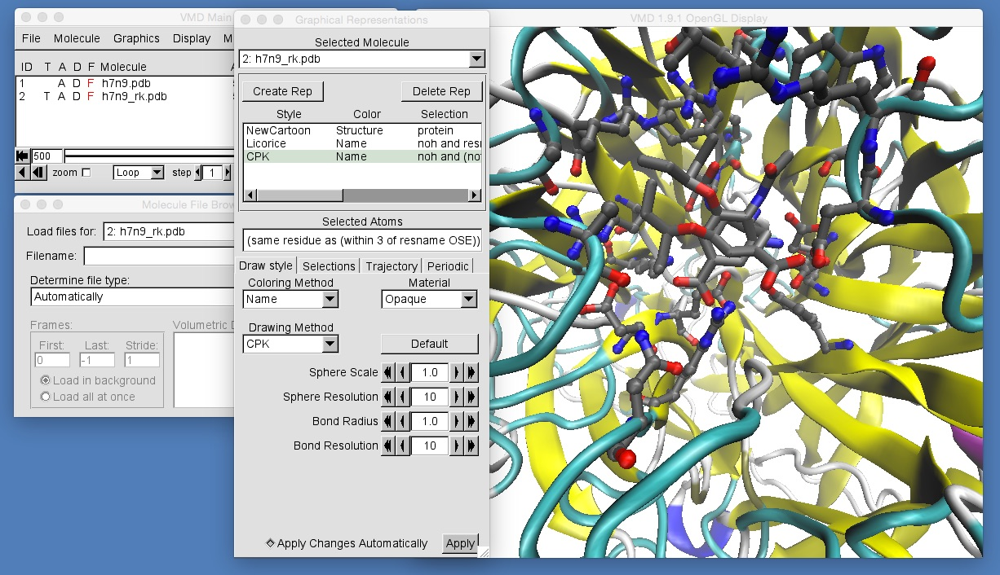

# Part 1: Molecular Visualisation
## Comparing Trajectories

The final thing we will learn in VMD is how to load up and compare the output of two different molecular dynamics trajectories. Please download the below two files and place them into the same directory as h7n9.pdb and h7n9.dcd

* [h7n9_rk.pdb](https://raw.githubusercontent.com/chryswoods/python_for_bio/master/dynamics/visualisation/h7n9_rk.pdb) : This is a PDB file containing oseltamivir bound to the R292K mutant of H7N9 neuraminidase
* [h7n9_rk.dcd](https://docs.google.com/uc?id=0B_KkGMZ8ACfaUWR4eUN6emxfQlk&export=download) : This contains the trajectory from a 50 nanosecond molecular dynamics simulation of oseltamivir bound to the R292K mutant of H7N9 neuraminidase.

Next, we will load up the h7n9_rk.pdb file in addition to the h7n9.pdb file that is already loaded into your VMD session. To do this, click "File | New Molecule..." in the VMD main window to open the "Molecule File Browser" window. Then, ensuring that the "Load files for:" selector is selecting "New Molecule", click "Browse" and find the h7n9_rk.pdb file that you downloaded. Select this and click "Load" to load this file.

Next, we will load the trajectory in h7n9_rk.dcd into the molecules loaded from h7n9_rk.pdb. To do this, in the "Molecule File Browser" window change the "Load files for:" selector to select "2: h7n9_rk.pdb". Then click "Browse" and find the h7n9_rk.dcd file that you downloaded. Select this and click "Load" to load this file.

The molecules in h7n9_rk.pdb are currently visualised using the "lines" representation. Go into the graphical representations window and add representations to match those for h7n9.pdb. To do this, you will need to ensure that the "Selected Molecule" selector at the top of the "Graphical Representations" window is selecting "2: h7n9_rk.pdb", e.g.

Once you have done this, zoom in to get a view similar to that in the above picture. You should be able to see that the molecules in h7n9_rk.pdb are not aligned with those in h7n9.pdb, and so oseltamivir in h7n9_rk.pdb appears rotated by about 90 degrees compared to oseltamivir in h7n9.pdb. This makes comparison of the two trajectories difficult. What we need to do is to ensure that all of the frames from both trajectories are aligned against a common frame of reference. In general, the best frame of reference for any bimolecular alignment is the protein backbone at the start of the trajectory for one of the structures. In this case we will use the backbone of h7n9 neuraminidase. To align the structures, we need to use the "RMSD Trajectory Tool" that comes with VMD. Open this by clicking "Extensions | Analysis | RMSD Trajectory Tool" in the VMD main window. This will open up the "RMSD Trajectory Tool" window, which is described in the image below.

# [Previous](picking.md) [Up](README.md) [Next](whatnext.md)
