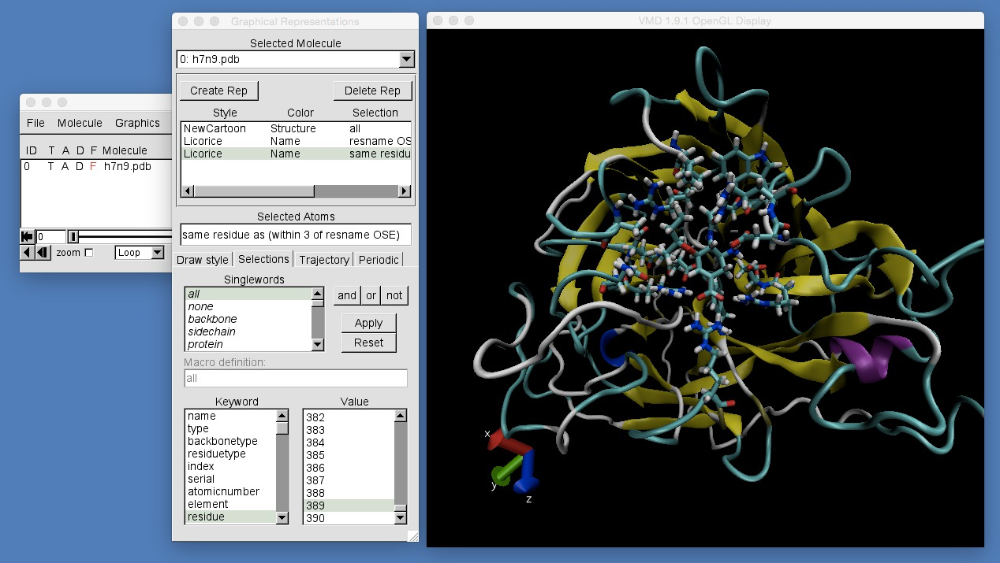

# Part 1: Molecular Visualisation
## Complex Selections

Selections in VMD can be even more complicated and powerful. For example, you can select atoms according to how close they are to other atoms. Create a new representation and set the "Selected Atoms" text to "within 3 of resname OSE". You should see the following;


This has selected all atoms that are within 3 angstroms of any atom that is part of the residue called "OSE". The "within" selection has the following syntax;

```
within DISTANCE of SELECTION
```

where `DISTANCE` is the distance, in angstroms, that a selected atom will be within of any atom in the molecule that matches `SELECTION`. For exmaple,

```
within 5 of alpha_helix
```

will select all atoms that are within 5 angstroms of an alpha helix atom.

One problem with selecting atoms by distance, is that it also selects that atoms that are part of `SELECTION`. In the first string, "within 3 of resname OSE", we selected all of the atoms in residue "OSE" as well as all of the protein atoms that are within 3 angstroms of the drug. If you want to limit the selection, you can use VMD's logical operators to combine together selections, e.g.

```
(not resname OSE) and (within 3 of resname OSE)
```

will combine "not resname OSE" with "within 3 of resname OSE" to find all atoms that are within 3 angstroms of "resname OSE" AND are NOT "resname OSE". VMD supports the logical expressions "AND", "NOT" and "OR", e.g.

```
(within 5 of alpha_helix) or (within 5 of beta_sheet)
```

would select all atoms that were within 5 angstroms of an alpha helix OR 5 angstroms of a beta sheet.

Another problem with selecting atoms by distance is that you can end up selecting only single atoms, rather than all of the atoms in a residue. With the "within 3 of resname OSE" you selected a lot of individual hydrogen atoms (white atoms), but you cannot see to which residues these hydrogens belong. To select all atoms in a residue, even when only one atom in the residue is close enough, use;

```
same residue as (within 3 of resname OSE)
```

Try putting this into VMD and you should see the following;


You can now see all residues that have at least one atom that is within 3 angstroms of oseltamivir.

Finally, these selections can look a little messy. One way to clean things up is to only select non-hydrogen atoms. You can do this using the selection "noh", which means "any non-hydrogen atom". Combining everything together, we can select and view non-hydrogen atoms of residues that have at least one atom within 3 angstroms of oseltamivir, but are not part of oseltamivir, using;

```
(not resname OSE) and noh and (same residue as (within 3 of resname OSE))
```

Use this selection and draw it using the "CPK" drawing method and you should see;




# [Previous](selection.md) [Up](README.md) [Next](picking.md)
