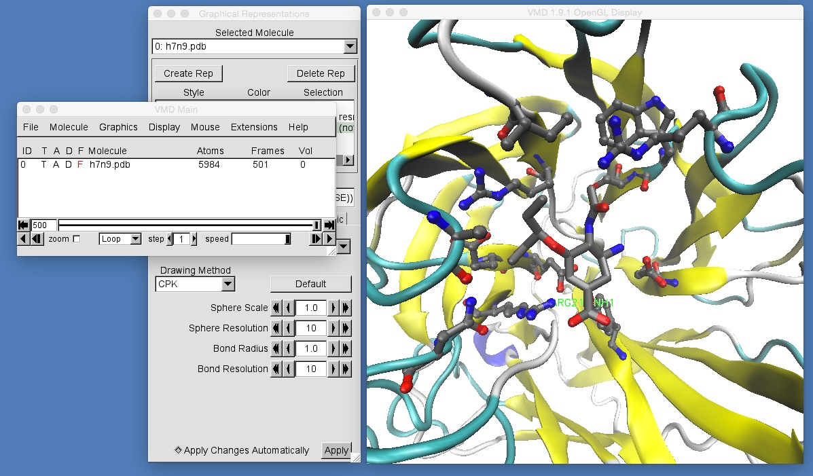
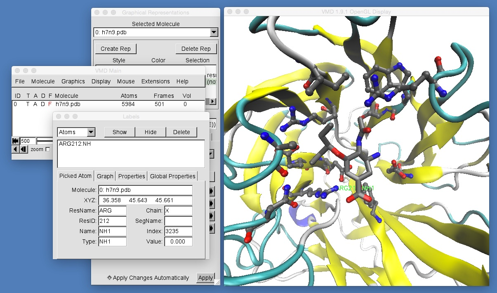

# Part 1: Molecular Visualisation
## Picking Atoms

As well as allowing you to view molecules, VMD also allows to you select atoms. You can do this by clicking “Mouse | Label | Atoms” in the VMD main window, and then clicking on individual atoms in the VMD graphics window. For example, in the [original paper](http://www.nature.com/srep/2013/131220/srep03561/full/srep03561.html) on which this workshop is based it was noted that there were two variants of H7N9 neuraminidase; the wild type form, and a mutant form in which the arginine (R) residue at position 292 was mutated to lysine (K).

We will now use the “select atoms” feature to label the Arginine 292 residue in the wild type H7N9 neuraminidase that you have loaded into VMD. This residue is to the bottom right of oseltamivir. Make sure that you are ready to select atoms (you have clicked “Mouse | Label | Atoms” and then click on one of the atoms of Arginine 292 as shown in the below picture;

Clicking on the atom adds a (barely visible!) green label to that atom. You can get more detail by opening the “Labels” window. Do this by clicking “Graphics | Labels”.

# [Previous](complex_selection.md) [Up](README.md) [Next](mouse.md)
