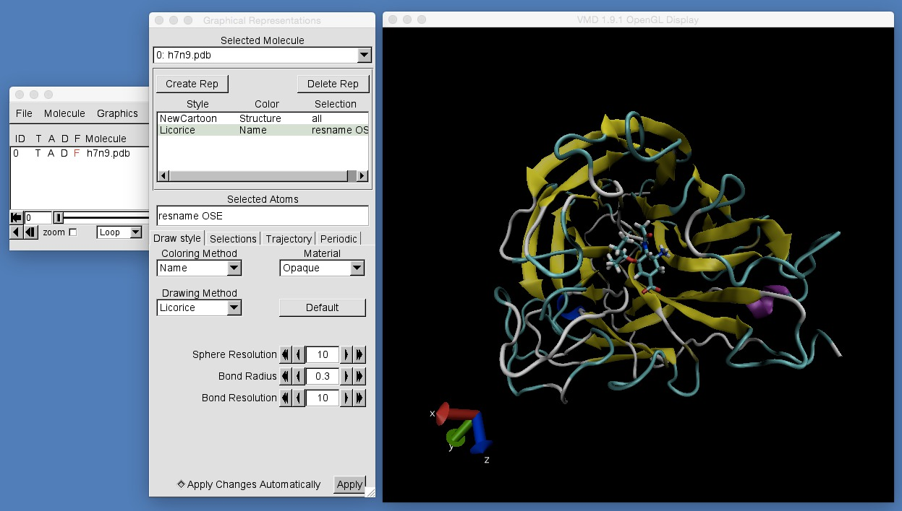
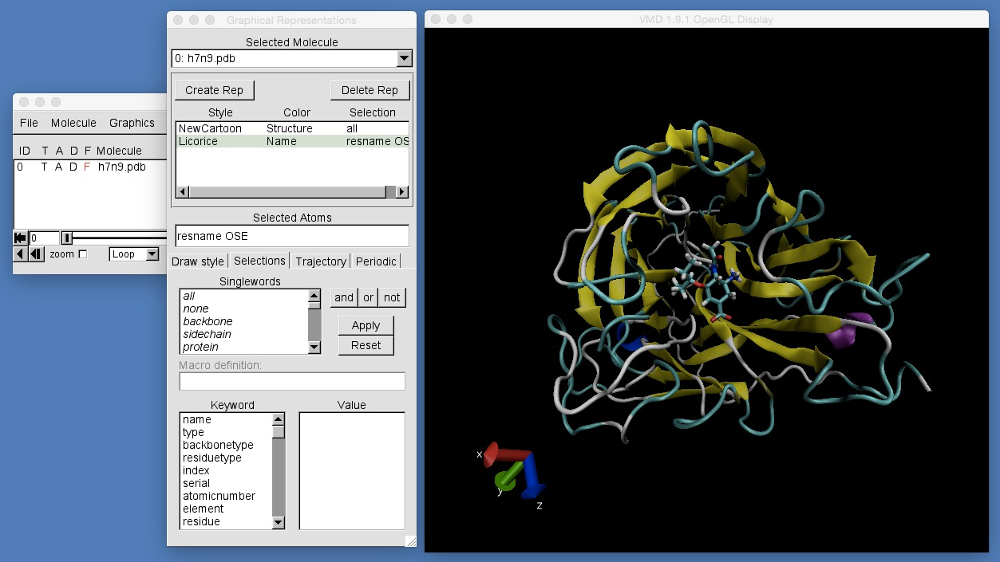
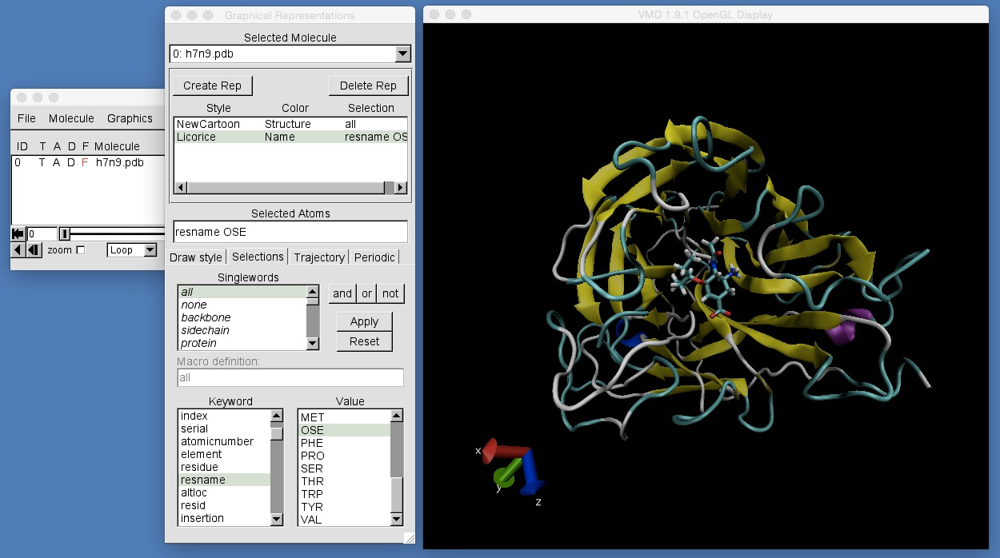

# Part 1: Molecular Visualisation
## Selected Atoms

The "Selected Atoms" box provides a way to select only a subset of atoms to draw. The 'h7n9.pdb' file that you have loaded actually contains more than just the H7N9 neuraminidase protein. It also contains a single oseltamivir drug molecule that is bound in the active site. 

* To view this molecule, click "Create Rep" to create a new representation. 
* Then, in the "Selected Atoms" box, change "All" to read "resname OSE". 
* Then change the coloring method to "Name" and the drawing method to "Licorice". 

If you do this, you should see the following;



To help with categorising, we arrange atoms in molecules into residues. The "resname OSE" selection string tells VMD to select only the atoms that are part of the residue called "OSE".

How do we know that the atoms in oseltamivir are in the residue called "OSE"? There are two ways to know. We can either take a look in the original PDB file and look for the lines that describe these atoms, e.g. on line 5940 of h7n9.pdb we find;

```
ATOM   5935 HD23 LEU   388      20.452  36.384  64.467  0.00  0.00
ATOM   5936  C   LEU   388      18.189  32.762  65.557  0.00  0.00
ATOM   5937  O   LEU   388      17.033  32.579  65.892  0.00  0.00
ATOM   5938  OXT LEU   388      19.161  32.097  65.932  0.00  0.00
TER    5939      LEU   388
ATOM   5940  O3  OSE   389      39.883  39.200  43.708  0.00  0.00
ATOM   5941  C6  OSE   389      39.404  39.770  42.740  0.00  0.00
ATOM   5942  C7  OSE   389      39.561  39.252  41.385  0.00  0.00
ATOM   5943  H5  OSE   389      39.590  38.162  41.442  0.00  0.00
ATOM   5944  H6  OSE   389      40.543  39.507  40.982  0.00  0.00
ATOM   5945  H7  OSE   389      38.744  39.520  40.712  0.00  0.00
ATOM   5946  N1  OSE   389      38.466  40.721  42.797  0.00  0.00
ATOM   5947  H23 OSE   389      38.012  40.929  41.920  0.00  0.00
```

The "TER" is used in a PDB file to divide a file into multiple molecules. This "TER" is dividing the protein from the drug molecule, and so we can see that the atoms of the drug are placed into the residue called "OSE" (the fourth column in each line).

An easier way to find that the drug is called "OSE" is to use the "Selections" tab in VMD's "Graphical Representations" window. In the "Graphical Representations" window click on "Selections" (one of four tabs, "Draw Style", "Selections", "Trajectory" and "Periodic"), and you will see the following.



This tab shows you all of the selection strings that are possible. The first box contains the single-word selection strings, e.g.

* "all" - selects all of the atoms
* "none" - selects no atoms
* "backbone" - selects only protein backbone atoms
* "sidechain" - selects only protein sidechain atoms
* "protein" - selects only protein atoms
* "water" - selects only water atoms
* "alpha_helix" - selects only atoms part of an alpha helix

The second box contains the "keyword" type selections. One of these keywords is "resname" which means to select atoms by the name of their residue. Click on "resname". This will show, in the right-hand box, all of the residue names of the loaded molecule. Scroll down and you will see that "OSE" is one of these names, e.g.



In addition to selecting atoms by the name of their residue, you can also use these "keyword" selections to select atoms by name (using the "name" keyword), by residue number (using the "resid" keyword) and by residue indices (using the "residue" keyword).

To choose a selection, edit the string in the "Selected Atoms" box so that it contains the text that you want, e.g. to select all atoms in residue 350, change the "Selected Atoms" string to read;

```
residue 350
```

You should find that this selects one of the residues in the protein.

Play around with different selections and representations. Try creating different representations for the alpha helices, protein sidechains and oseltamivir.

# [Previous](representations.md) [Up](README.md) [Next](complex_selection.md)
