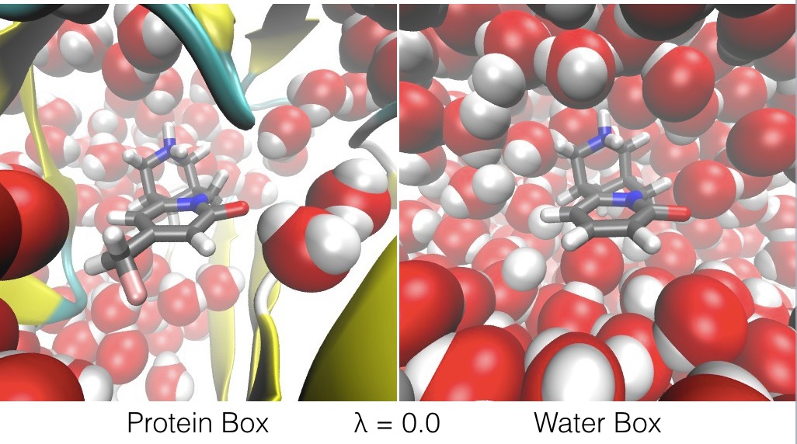
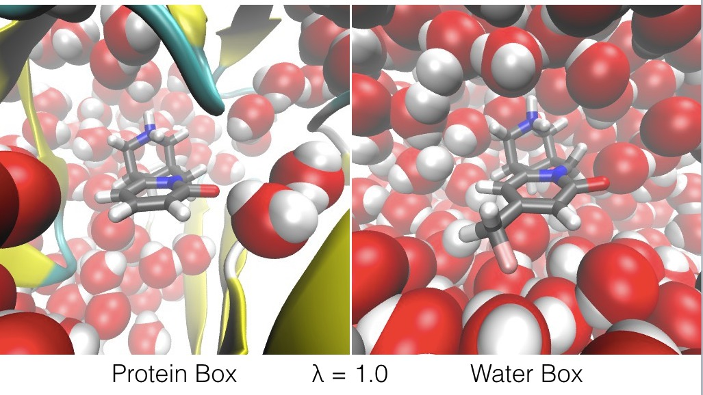

# Calculating relative binding free energies using ligandswap

This will be a short tutorial on how to use the ligandswap method implemented
in the `ligandswap` program 
that comes with [Sire](http://siremol.org) to calculate relative binding free energies.

Ligandswap is an efficient and theoretically robust method of predicting
the relative binding affinities of guest molecules (ligands) to host
molecules (e.g. proteins). 

For example, ligandswap can be used to calculate the relative binding free
energy of two ligands, A and B, to a protein. It works by constructing
a λ-coordinate that connects a periodic box of water containing 
ligand A bound to the protein (the `Protein Box`), with a second periodic box of water that
contains ligand B on its own (the `Water Box`);

The λ-coordinate is used to swap ligands A and B, such that;

* at λ=0.0, ligand A is bound to the protein, and ligand B is free in water (as shown above),
* at λ=1.0, ligand B is bound to the protein, and ligand A is free in water (as shown below),

* and at λ values in between, ligands A and B are both *partially* bound to the protein,
  and both ligands A and B are both *partially* free in water (as shown below).

The free energy change along this ligandswap λ reaction coordinate can
be calculated using any standard free energy method, e.g. [free energy perturbation
(FEP)](https://en.wikipedia.org/wiki/Free_energy_perturbation), [Bennett acceptance ratio method (BAR)](https://en.wikipedia.org/wiki/Bennett_acceptance_ratio) or [thermodynamic integration (TI)](https://en.wikipedia.org/wiki/Thermodynamic_integration). Indeed,
to measure error, the `ligandswap` program with Sire calculates the free energy
using all three methods at the same time.

If you want more information about ligandswap, please [take a look here](theory.md).

## Contents

* [Getting Started](getting_started.md)
* [Understanding the files](files.md)
* [Running a ligandswap calculation](running.md)
* [Understanding the output](output.md)
* [Simulation options](options.md)
* [Analysis of results](analysis.md)
* [Visualising free energy](visualisation.md)
* [What next?](whatnext.md)
* [Appendix: Ligandswap theory](theory.md)
* [Appendix: Sire Energy Visualizer Chimera plugin](chimera.md)

***

# [Previous](README.md) [Up](README.md) [Next](getting_started.md)
