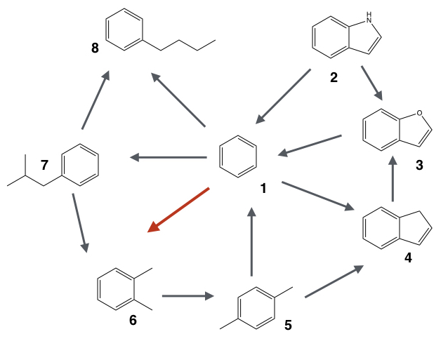

#<center>SOMD Free Energy of Binding Tutorial</center>
####<center>Step One: Introduction to Free energy calculations and how to use FESetup for the setup. </center>

###1. An introduction to relative alchemical free energy calculations
[1] [alchemistry.org](http://www.alchemistry.org/wiki/Main_Page)

###2. Using FESetup for relative calculations with SOMD.
Here we will in fact follow the tutorial within FESetup, written by Hannes Löffler, with slight modifications. 

In order to obtain the tutorial files please click [here](Data/FESetup.zip).
Let's start by creating a tutorial directory and place the unzipped FESetup file into that directory.

```bash
mkdir Tutorial_free_energy
mv /path/to/FESetup.zip Tutorial_free_energy
cd Tutorial_free_energy
unzip FESetup.zip
```

The FESetup directory should have the following content:

```
ls FESetup
ligands  setup.in  proteins

```

We now also have a directory with ligands. The coordinates of the ligands and that of the protein need to be in the same reference frame, i.e. the ligands need to fit into the binding pocket. Using VMD this can easily be double checked. The ```setup.in``` file contains again all the necessary directives to set up your alchemical simulation. Let's look at some of the parts in more detail. 

```bash
logfile = T4-lysozyme.log
forcefield = amber, ff99SBildn, tip3p, cm
FE_type = Sire

[ligand]
basedir = ligands
file.name = ligand.mol2
# the following are required to create the morph in solution
box.type = rectangular
box.length = 12.0
neutralize = yes
min.nsteps = 100

morph_pairs = morph_pairs = benzofuran > benzol,
        benzol > indene,
        indole > benzol,
        indene > benzofuran,
        indole > benzofuran,
        benzol > isobutylbenzene,
        benzol > n-butylbenzene,
        isobutylbenzene > n-butylbenzene,
        isobutylbenzene > o-xylene,
        o-xylene > p-xylene,
        benzol > o-xylene,
        benzol > p-xylene,
        p-xylene > indene
```

We now have a new section called ```[ligand]```, which contains all the information for the ligand simulation setup. ```basedir = ligands``` and ```file.name = ligand.mol2``` tell FESetup to look in the directory ligands for filenames ```ligand.mol2```. Looking into that directory, there are a bunch of ligands in directories. The ```[ligands]``` directive alone with the box information will guarantee that each ligand is parametrised using the generalised amber forcefield (GAFF), neutralised and minimised. The parameter ```FE_type = Sire```, sets the output to be compatible with a  SOMD free energy calculation, however Gromacs and AMBER output formats are also supported. A perturbation network, as seen below, is setup in the inputfile. The following syntax ```n-butylbenzene > p-xylene``` indicates the alchemical perturbations that should be carried out.  
<center>

*Perturbation network example for Lysozyme ligands.* 
</center>

The other new section in the input file is called ```[complex]```. It means that a complex between the protein and the ligand should be formed and solvated in a box and minimised. 
Below is the example from the tutorial input. 

```
[complex]
# the following are required to create the morph in solution in ligand and protein complex
box.type = rectangular
box.length = 12.0
align_axes = True
neutralize = yes

min.nsteps = 200
min.ncyc = 100
```

FESetup is run as before:

```
FESetup setup.in
```
In the case of the alchemical setup a few more output files are generated. The FESetup directory should now look like this:

```
_complexes  _ligands    _perturbations  _proteins  T4-lysozyme.log
ligands     _mols.done  proteins        setup.in
```
First of all the logfile ```T4-lysozyme.log``` contains all AMBER Tools commands executed to parameterise and setup the ligands and protein separately and in complex. ```_proteins``` contains the solvated and minimised protein file. ```_ligands``` contains the parameterised ligands solvated in a water box and in vacuum. ```_complexes``` contains solvated setup of each ligand bound to the protein and ```_perturbations``` is the directory that contains all the necessary input for running an alchemical relative free energy calculation, with perturbations ready in protein complex format as well as just the solvated ligands. 
It might be worth while to also equilibrate using FESetup, rather than SOMD, but will be covered elsewhere.  

<center> <a href="Equib.html"> </a> </center>

&nbsp;
&nbsp;
&nbsp;
<center>
<a href="FESetup.md"></a> 
<a href="Equib.md"></a> 
<a href="Production.md"></a> 
<a href="Analysis.md"></a>
</center>
