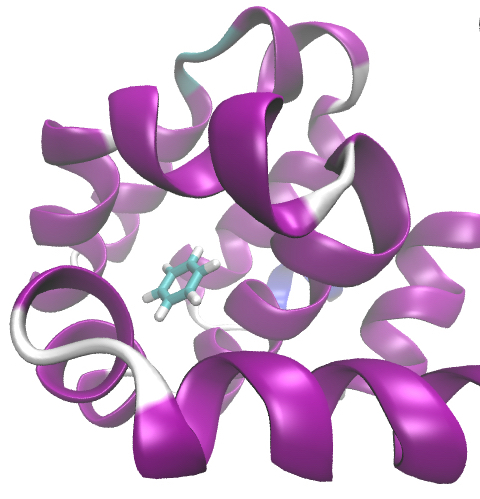

#<center>SOMD Free Energy of Binding Tutorial</center>
####<center>Step One: Running FESetup on a dataset of ligands and protein </center>

###Using FESetup to setup Lysozyme ligands.
Here we will in fact follow the tutorial within FESetup, written by Hannes Löffler, with slight modifications. 

In order to obtain the tutorial files please click [here](Data/FESetup.zip).
Let's start by creating a tutorial directory and place the unzipped FESetup file into that directory.

```bash
mkdir Tutorial_free_energy
mv /path/to/FESetup.zip Tutorial_free_energy
cd Tutorial_free_energy
unzip FESetup.zip
```

The FESetup directory should have the following content:

```
ls FESetup
ligands  setup.in  proteins

```

We now also have a directory with ligands. The coordinates of the ligands and that of the protein need to be in the same reference frame, i.e. the ligands need to fit into the binding pocket. Using VMD this can easily be double checked. 
For the example of benzol protein and ligand look like this:
<center>

*Lysozyme bound with benzol.* 
</center>


The ```setup.in``` file contains again all the necessary directives to set up the protein and the two ligands as well as directives necessary for the relative free energy calculations. Let's look at some of the parts in more detail. 

```bash
logfile = T4-lysozyme.log
forcefield = amber, ff14SB, tip3p, hfe
gaff = gaff2
AFE.type = Sire
AFE.separate_vdw_elec = false
mdengine = amber, pmemd


[ligand]
basedir = ligands
file.name = ligand.mol2
box.type = rectangular
box.length = 12.0
neutralize = yes
min.nsteps = 100
molecules = benzol, o-xylene

[protein]
basedir = proteins
molecules = 181L
propka = t

```

We now have a section called ```[ligand]``` and a section called ```protein```, which contains all the information for the ligand simulation setup. ```basedir = ligands``` and ```file.name = ligand.mol2``` tell FESetup to look in the directory ligands for filenames ```ligand.mol2```. Looking into that directory, there are a bunch of ligands in directories. The ```[ligands]``` directive alone with the box information will guarantee that each ligand is parametrised using the generalised amber forcefield (GAFF), neutralised and minimised. The parameter ```FE_type = Sire```, sets the output to be compatible with a  SOMD free energy calculation, however Gromacs and AMBER output formats are also supported. Respectively ```protein``` contains all information regarding the protein to be setup with the ligand. 

The other new section in the input file is called ```[complex]```. It means that a complex between the protein and the ligand should be formed and solvated in a box and minimised. 
Below is the example from the tutorial input. 

```
[complex]
# explicit enumeration of pairs, otherwise all-with-all creation
pairs = 181L : benzol, 181L : o-xylene

box.type = rectangular
box.length = 12.0
align_axes = True
neutralize = yes

min.nsteps = 200
min.ncyc = 100
```

FESetup is run as before:

```
FESetup setup.in
```
In the case of the alchemical setup a few more output files are generated. The FESetup directory should now look like this:

```
_complexes  _ligands    _perturbations  _proteins  T4-lysozyme.log
ligands     _mols.done  proteins        setup.in
```
First of all the logfile ```T4-lysozyme.log``` contains all AMBER Tools commands executed to parameterise and setup the ligands and protein separately and in complex. ```_proteins``` contains the solvated and minimised protein file. ```_ligands``` contains the parameterised ligands solvated in a water box and in vacuum. Up to this point we can just run box standard molecular dynamics simulations of a protein with two different ligands bound. The necessary data for this can be found in ```_complexes```. In order to actually do an alchemical free energy calculations we need to generate a set of perturbations. This will be done with a separate morph file, called ```morph.in```. 

```bash
FE_type = Sire
AFE.separate_vdw_elec = False

[globals]
forcefield = amber, ff14SB, tip3p
gaff = gaff2
logfile = dGmorph.log

[ligand]
basedir = ligands
file.name = ligand.mol2

morph_pairs = benzol > o-xylene,
        o-xylene > benzol

[protein]
basedir = proteins
molecules = 181L
propka = t

[complex]
# the following are required to create the morph in solution
box.type = rectangular

```
The file is again run as before:
```
FESetup morph.in
```
and the output will look something like this:

```bash
=== FESetup release 1.3dev, SUI version: 0.8.1 ===

Making biomolecule 181L...
Morphs will be generated for Sire
Morphing benzol to o-xylene...
Morphing o-xylene to benzol...
Creating complex 181L:benzol with ligand morph benzol~o-xylene...
Creating complex 181L:o-xylene with ligand morph o-xylene~benzol...

=== All molecules built successfully ===

```

 The output will have generated a directory called ```_perturbations``` that contains all the necessary input for running an alchemical relative free energy calculation, with perturbations ready in protein complex format as well as just the solvated ligands. 
It might be worth while to also equilibrate using FESetup, rather than SOMD, but will be covered elsewhere.  

<center> <a href="Equilibration.html"> </a> </center>

&nbsp;
&nbsp;
&nbsp;
<center>
<a href="FESetup.md"></a> 
<a href="Equilibration.md"></a> 
<a href="Production.md"></a> 
<a href="Analysis.md"></a>
</center>
